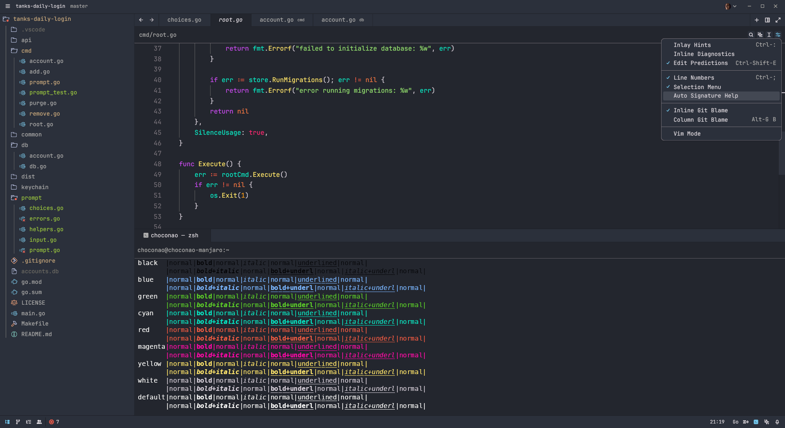

# Andromeda Theme for Zed

A popular [VScode theme](https://github.com/EliverLara/Andromeda) ported to [Zed](https://zed.dev/) with some minor adjustments (since the Zed's [theme_importer](https://github.com/zed-industries/zed/tree/main/crates/theme_importer) still not good enough to seamlessly replicate VScode themes).

> [!NOTE]
> The port also includes an italic variant

<details>
<summary>Preview (icons from <i>Catppuccin Icons</i> extension)</summary>

</details>

## Usage

### Manual Installation

1. Download the `.json` file with the theme variant of your choice from the [latest release](https://github.com/ChocolateNao/andromeda-zed/releases/latest)
2. Navigate to `~/.config/zed/themes/` and place the file inside
3. Enter _theme selector: toggle_ in the command palette (<kbd>Ctrl</kbd>+<kbd>Shift</kbd>+<kbd>P</kbd>) and select your variant of __Andromeda__ theme in the dropdown

### Zed Extensions

1. Open Zed
2. Press <kbd>Ctrl</kbd>+<kbd>Shift</kbd>+<kbd>X</kbd> to open Zed extensions menu (alternatively, you can open the menu by typing _zed: extensions_ in the command palette (<kbd>Ctrl</kbd>+<kbd>Shift</kbd>+<kbd>P</kbd>))
3. Search for the __Andromeda__ extension and install it

> [!TIP]
> After installation, a popup with avaliable variants will appear. You can switch to another variant at any time by entering _theme selector: toggle_ in the command palette and selecting the preferred variant of __Andromeda__ theme in the dropdown

## Development

Variants are developed in a separate file with the same top level `name` field.

Aside from the theme itself, the repository is packed with a script called `italize.js` that can be used to create an italized variant of the theme automatically, for example:

```bash
# run it directly
node scripts/italize.js andromeda.json

# or via npm
npm run italize andromeda.json
```

## License

[MIT](https://github.com/ChocolateNao/andromeda-zed/blob/master/LICENSE)
